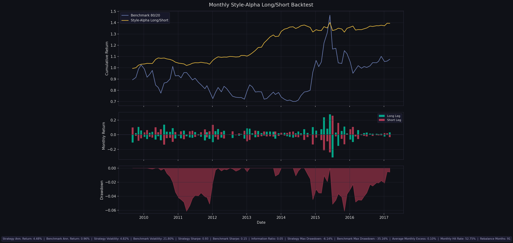

# Style-Alpha Long/Short Fund Strategy

[](https://www.python.org/)


An alpha-ranking, style-balanced long/short mutual fund strategy for the China A-share fund universe.
It combines a factor-based style classification model with monthly cross-sectional alpha ranking, then trades with a no-lookahead execution rule that waits until the next weekly NAV date after each month-end signal.

This repository contains a Python rebuild of a legacy Chinese mutual fund style-classification workflow and a monthly long/short backtest built on top of it.

The strategy is:

- group funds by style
- rank funds within each style bucket by alpha
- go long the top 10% in each style bucket
- go short the bottom 10% in each style bucket
- rebalance monthly

The benchmark is:

- `80% * CSI 300 + 20% * SSE Treasury Index`

The current backtest implementation uses a no-lookahead timing rule:

- generate the signal at month-end
- trade at the next available weekly fund NAV date
- hold until the next signal's execution date

## Strategy Logic

The workflow has two layers.

### 1. Monthly style and alpha estimation

At each month-end signal date, the script rebuilds a trailing factor panel and estimates each fund's risk exposures using a three-factor regression:

`fund excess return = alpha + beta_m * (Rm - Rf) + beta_s * SMB + beta_h * HML + error`

Inputs:

- stock-level market data to build `Rm`, `SMB`, and `HML`
- mutual-fund-level NAV data to estimate each fund's alpha and style
- a risk-free-rate series from `Rf.xlsx`

For the backtest script, the monthly snapshot uses a practical, lightweight classification rule:

- if both `SMB` and `HML` loadings are statistically significant, classify the fund by the sign of those coefficients
- otherwise classify the fund as `Alpha`
- require at least `52` weekly observations by default

This keeps the monthly backtest tractable while staying close to the logic of the broader research pipeline.

### 2. Portfolio construction

For each monthly signal date:

- split funds into style buckets
- rank funds within each bucket by estimated alpha
- select the top 10% and bottom 10%
- assign equal gross weight to each active style bucket
- equal-weight funds within each side of each bucket

If only two style buckets are tradable in a month, each bucket gets half of the total long gross and half of the total short gross.

## No-Lookahead Execution

The backtest is intentionally implemented to avoid the most obvious timing bias in mutual fund data.

It does **not** assume that a fund can be observed and traded at the same month-end NAV. Instead:

- the signal is built with information available through month-end
- the trade is executed at the next weekly NAV date
- the benchmark is measured over the same execution window

This matters because fund NAVs are end-of-period values, so trading at the same NAV used to form the signal would introduce look-ahead bias.

## Repository Structure

- [`style_alpha_long_short_strategy.py`](style_alpha_long_short_strategy.py)
  Main strategy and backtest script.
- [`fund_strategy_pipeline.py`](fund_strategy_pipeline.py)
  Python rebuild of the legacy factor and classification pipeline.
- [`data_input/2017Q1`](data_input/2017Q1)
  Example quarter input snapshot.
- [`akshare_index_data/sh000300.csv`](akshare_index_data/sh000300.csv)
  CSI 300 benchmark input.
- [`akshare_index_data/sh000012.csv`](akshare_index_data/sh000012.csv)
  SSE Treasury benchmark input.

## Requirements

The backtest script uses:

- Python 3.10+
- `numpy`
- `pandas`
- `matplotlib`

Example install:

```bash
pip install numpy pandas matplotlib
```

## Quick Start

Run the no-lookahead backtest on the bundled example data:

```bash
python style_alpha_long_short_strategy.py \
  --quarter-dir "data_input/2017Q1" \
  --hs300-path "akshare_index_data/sh000300.csv" \
  --treasury-path "akshare_index_data/sh000012.csv" \
  --output-dir "strategy_backtest_output/full_run_no_lookahead"
```

Key options:

- `--history-weeks`
  Rolling lookback window used for factor regression. Default: `448`
- `--min-observations`
  Minimum weekly observations required to enter a style bucket. Default: `52`
- `--long-quantile`
  Fraction held long within each style bucket. Default: `0.10`
- `--short-quantile`
  Fraction held short within each style bucket. Default: `0.10`
- `--exclude-alpha-bucket`
  Exclude the `Alpha` bucket from portfolio construction

## Outputs

The strategy script writes:

- `monthly_backtest.csv`
- `monthly_holdings.csv`
- `performance_metrics.json`
- `style_alpha_long_short_backtest.png`

The backtest output includes both signal timing and execution timing:

- `signal_date`
- `trade_date`
- `next_signal_date`
- `exit_date`

## Example Results

Using the bundled sample data and the no-lookahead execution rule, the current example run produced:

- Strategy Ann. Return: `4.48%`
- Benchmark Ann. Return: `0.96%`
- Strategy Volatility: `4.82%`
- Benchmark Volatility: `21.80%`
- Strategy Sharpe: `0.93`
- Benchmark Sharpe: `0.15`
- Strategy Max Drawdown: `-6.14%`
- Benchmark Max Drawdown: `-35.16%`
- Monthly Hit Rate: `52.75%`
- Rebalance Months: `91`

These numbers come from:

- [`strategy_backtest_output/full_run_no_lookahead/performance_metrics.json`](strategy_backtest_output/full_run_no_lookahead/performance_metrics.json)

Backtest chart:



## Important Caveats

This repository is a research and reconstruction project, not a production trading system.

Important limitations:

- The bundled backtest uses a static example fund universe from the sample quarter snapshot, so survivorship and universe-selection bias may still exist.
- Fund NAV data is weekly, so monthly rebalancing is approximated with the next available weekly NAV date.
- The monthly strategy snapshot is simpler than the full production classification workflow; it uses significance-based style assignment instead of the full rolling-stability classification used elsewhere in the repo.
- Transaction costs, subscriptions/redemptions, liquidity constraints, and fund dealing cutoffs are not modeled.

## Related Documents

- [`STRATEGY_MODEL.md`](STRATEGY_MODEL.md)
  Higher-level explanation of the investment logic and model background.
- [`STRATEGY_README.md`](STRATEGY_README.md)
  Rebuild notes for the Python fund-style pipeline.
- [`REBALANCE_WORKFLOW.md`](REBALANCE_WORKFLOW.md)
  Operational workflow for refreshing the quarter snapshot and rerunning the classification pipeline.

## License / Use

This code is intended for research, auditing, and educational use. Validate the data, assumptions, and execution model before using it in any investment process.
