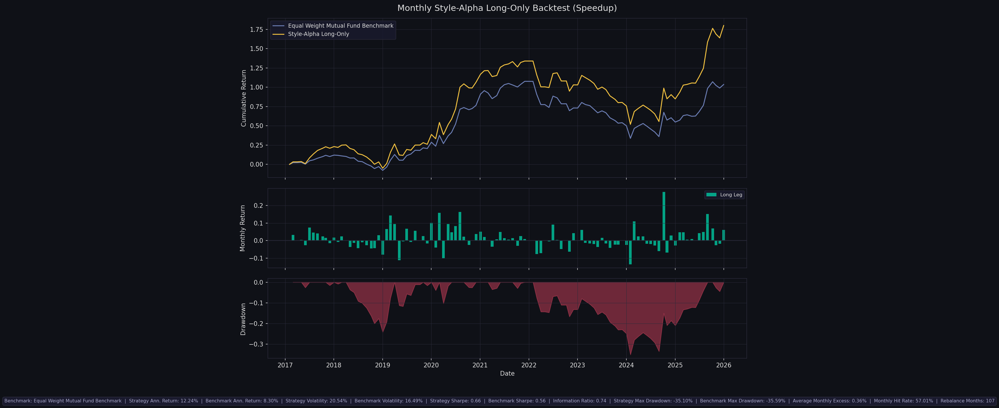

# Fund Strategy Research — Style-Alpha Mutual Fund Selection

Research repository for a **style-balanced, alpha-ranked mutual-fund-selection strategy**: funds
are classified into style buckets from their factor loadings, ranked within each bucket by
factor-adjusted alpha, and the top-alpha funds are held (long-only by default; long/short
optional). The same framework is applied to **two markets** so the results can be compared
head-to-head.

The headline question this repo answers: **does fund-level alpha persist well enough to select
on, and does that hold across markets?** The answer turns out to be **yes in China, no in the
U.S.** — and that contrast is the main result.

## Strategy Branches

- [`strategy_2026/`](strategy_2026/) — **China** active-equity funds. Daily cumulative NAV,
  CH-3 factors (`mktrf, SMB, VMG`), monthly no-lookahead rebalancing.
- [`strategy_2026_US/`](strategy_2026_US/) — **U.S.** active-equity funds. CRSP monthly returns,
  Fama–French 5 + momentum factors, annual rebalancing with a configurable factor model.
- [`strategy_2017/`](strategy_2017/) — earlier **weekly** China version, kept as the legacy
  baseline and reconstruction reference.

## Headline Result — Cross-Market Comparison

Identical construction in both markets: **long-only, top-decile alpha within each style bucket,
benchmarked against the equal-weight (EW) peer-fund average.**

| Market | Sample | Strategy Ann. | EW Peers Ann. | Value-Weight Peers | IR vs EW | Verdict |
| --- | --- | ---: | ---: | ---: | ---: | --- |
| **China** ([`strategy_2026`](strategy_2026/)) | 2016–2025 | **12.24 %** | 8.30 % | n/a | **+0.74** | **beats peers — real edge** |
| **U.S.** ([`strategy_2026_US`](strategy_2026_US/)) | 2010–2025 | 11.01 % | 11.06 % | **12.52 %** | −0.04 | **matches EW, loses to value-weight — no edge** |

- In **China**, the strategy beats the equal-weight peer average by ~3.9 %/yr with a 0.74
  information ratio and a 57 % monthly hit rate — a genuine selection edge. (The market-neutral
  long/short mode reaches Sharpe ~1.4; see the China README.)
- In the **U.S.**, the same construction merely tracks the equal-weight peer average and loses
  to a value-weight (investable) peer benchmark. An exhaustive **31,104-combination** grid search
  found only **1.6 %** of configurations beat the value-weight benchmark, with a negative
  *marginal* information ratio for every parameter value — i.e. the apparent "best" runs are
  in-sample overfitting.

**Interpretation.** The strategy monetizes cross-sectional *persistence* of fund alpha. That
premise holds in the retail-dominated, less-efficient China market but largely fails in the
highly competitive U.S. market, consistent with the weak post-fee skill persistence of U.S.
active funds (Carhart 1997; Fama–French 2010). The negative U.S. result is expected, not a bug —
and the China-vs-U.S. contrast is itself the finding.

### China backtest (long-only vs equal-weight peers, 2016–2025)

Sources:
[China metrics](strategy_2026/backtest_output_speedup/performance_metrics_speedup.json) ·
[U.S. baseline chart](strategy_2026_US/backtest_output_annual/readme_chart.png) ·
[U.S. 31k grid](strategy_2026_US/parameter_search_output/grid_search_summary.csv)

## Repository Structure

- [`strategy_2026/`](strategy_2026/) — China daily strategy, workflow notes, parameter search, result snapshots
- [`strategy_2026_US/`](strategy_2026_US/) — U.S. strategy, dual EW/VW benchmarks, OFAT + cached grid search
- [`strategy_2017/`](strategy_2017/) — weekly legacy China version
- [`get_data/`](get_data/) — data download and preprocessing scripts
- [`data/`](data/) — shared processed data files

## Suggested Reading Order

1. [`strategy_2026/README.md`](strategy_2026/README.md) — China strategy (the positive result)
2. [`strategy_2026_US/README.md`](strategy_2026_US/README.md) — U.S. port (the negative result + tuning engine)
3. [`strategy_2026/WORKFLOW.md`](strategy_2026/WORKFLOW.md) — China research notes and regime discussion
4. [`strategy_2017/README.md`](strategy_2017/README.md) — legacy weekly framework

## Notes

- `strategy_2026` (China) is the main positive-result branch; `strategy_2026_US` documents the
  cross-market generalization test and its (negative) outcome.
- Both 2026 branches share the same logic: style classification from `smb`/`hml`-type loadings,
  within-bucket alpha ranking, no-lookahead execution, and equal-weight peer benchmarking.
- `strategy_2017` is retained to document the earlier weekly framework.
- Data-engineering scripts live under [`get_data/`](get_data/) to keep the strategy folders
  focused on modeling and backtesting.

## License / Use

Research, auditing, and educational use only. Validate the data, assumptions, and execution
model before using any of this in an investment process. This repository documents research
findings — including a deliberately reported **negative result** for the U.S. market — and is not
a deployable trading system.
