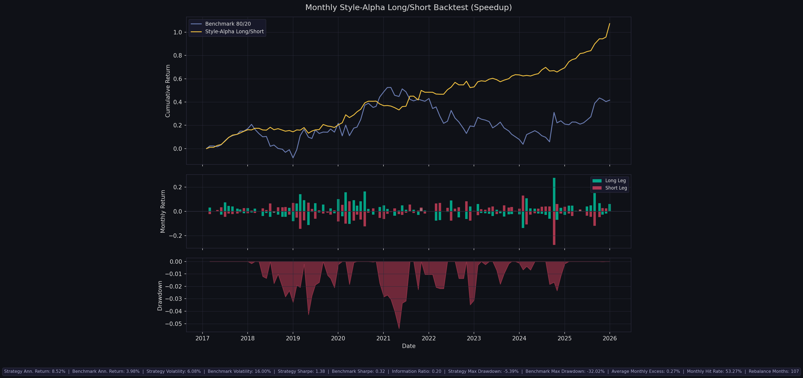

# Fund Strategy Research

Research repository for style-based long/short mutual fund strategies in the China active-equity fund universe.

The repository currently has two main strategy branches:

- [`strategy_2026/`](strategy_2026/)
  current daily-data strategy, benchmarked and backtested with a no-lookahead monthly rebalancing workflow
- [`strategy_2017/`](strategy_2017/)
  earlier weekly-data version kept as the legacy baseline and reconstruction reference

## Main Entry

The main strategy write-up is:

- [`strategy_2026/README.md`](strategy_2026/README.md)

This is the current production-style research version and includes:

- daily cumulative NAV (`累计净值`)
- CH-3 factor-based style classification
- monthly alpha-ranked long/short portfolio construction
- speed-up backtest and parameter-search workflow

## Result

Current reference daily run:

- sample: `2016-2025`
- strategy ann. return: `8.52%`
- benchmark ann. return: `3.98%`
- strategy Sharpe: `1.38`
- information ratio: `0.20`
- strategy max drawdown: `-5.39%`
- rebalance months: `107`

Source:

- [`strategy_2026/backtest_output_speedup_nnn_s2016_2025_h70_q10_a0_rw245_fb320/performance_metrics_speedup.json`](strategy_2026/backtest_output_speedup_nnn_s2016_2025_h70_q10_a0_rw245_fb320/performance_metrics_speedup.json)

Backtest chart:

## Repository Structure

- [`strategy_2026/`](strategy_2026/)
  current daily strategy, workflow notes, parameter search, and result snapshots
- [`strategy_2017/`](strategy_2017/)
  weekly legacy version and original-style benchmark comparison
- [`get_data/`](get_data/)
  data download and preprocessing scripts
- [`data/`](data/)
  shared processed data files used by the research workflow

## Suggested Reading Order

1. [`strategy_2026/README.md`](strategy_2026/README.md)
2. [`strategy_2026/WORKFLOW.md`](strategy_2026/WORKFLOW.md)
3. [`strategy_2017/README.md`](strategy_2017/README.md)

## Notes

- `strategy_2026` should be treated as the main strategy branch for presentation and ongoing research.
- `strategy_2017` is retained to document the earlier weekly framework and provide a historical comparison point.
- Data engineering scripts were moved under [`get_data/`](get_data/) to keep the strategy folders focused on modeling and backtesting.

## License / Use

This repository is intended for research, auditing, and educational use. Validate the data, assumptions, and execution model before using it in any investment process.
