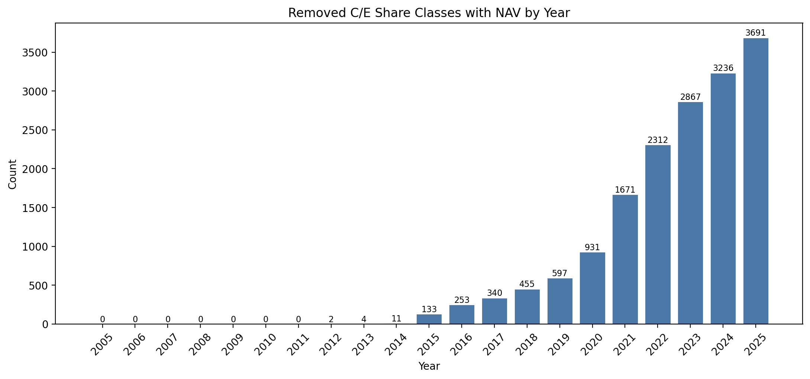
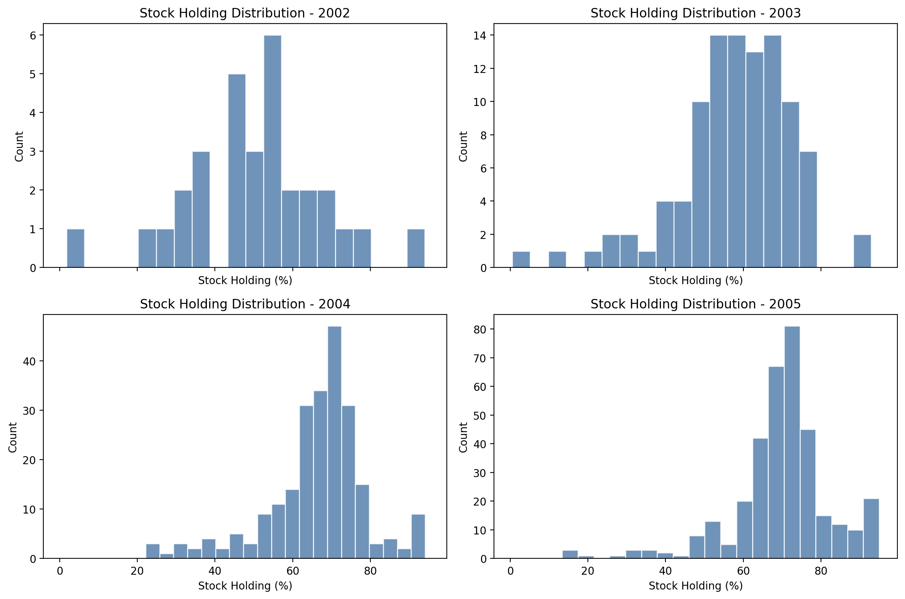
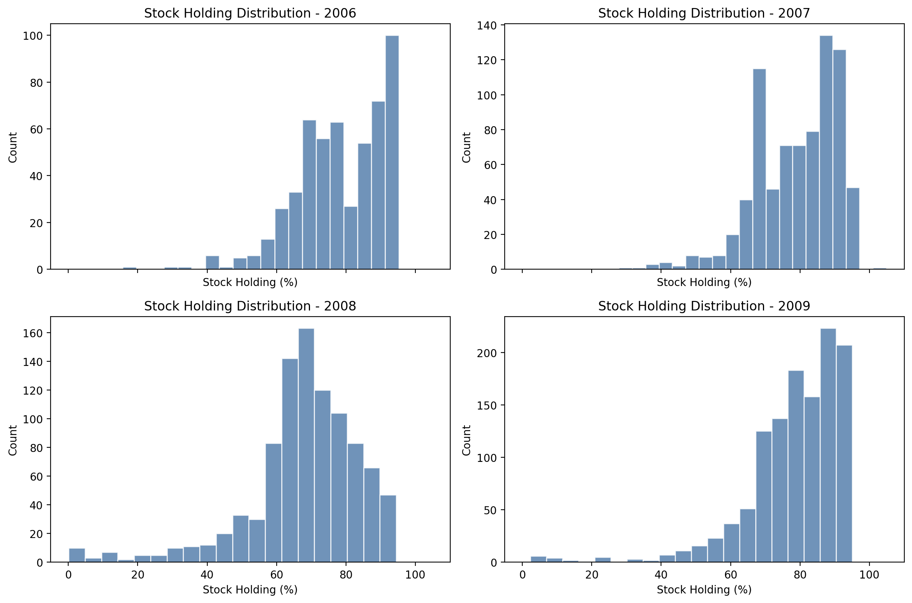
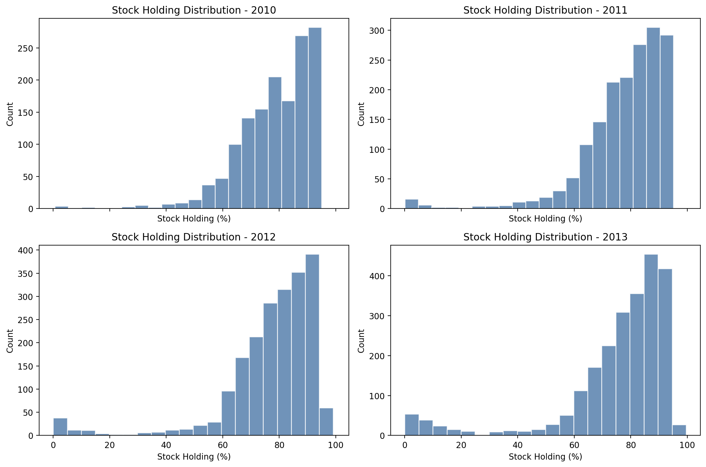
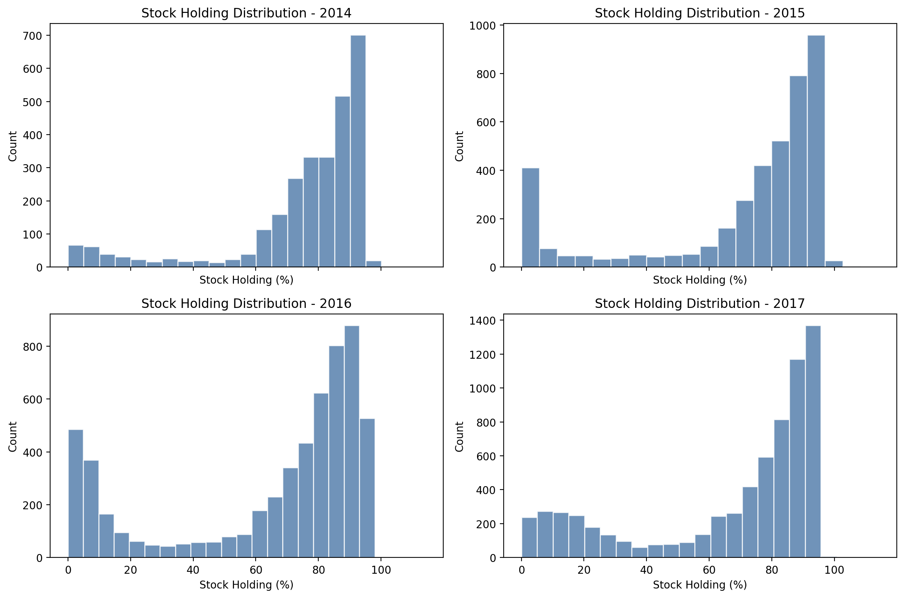
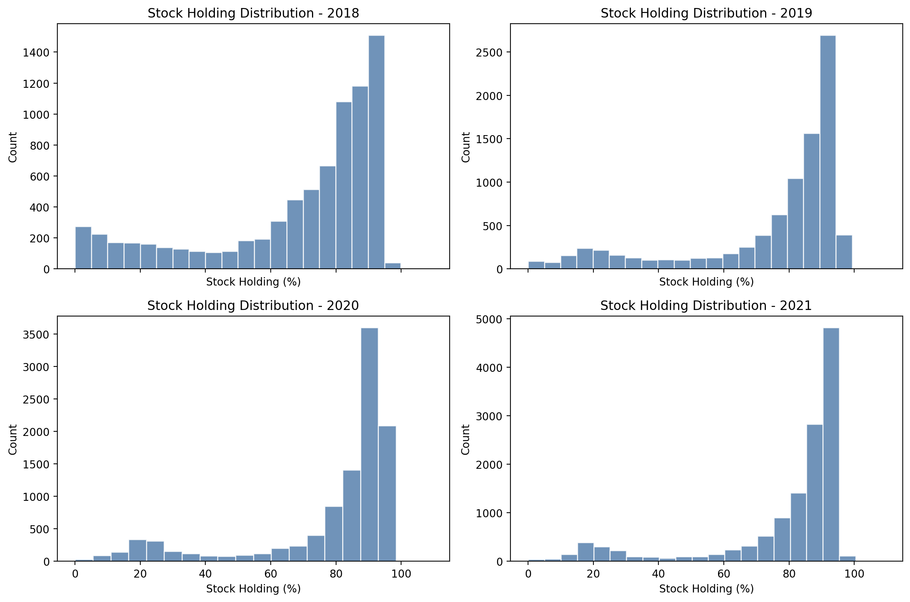
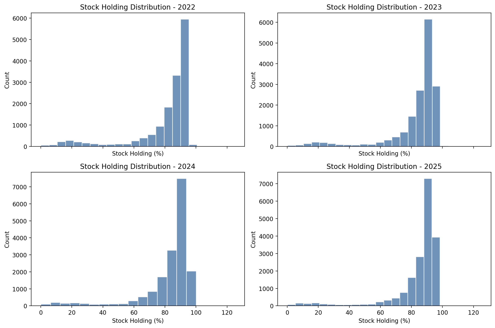

# Strategy 2026 Workflow

## Scope

This folder is the daily-data version of the fund strategy workflow.

The 2026 version will be built from:

- daily fund NAV data
- daily China factor data
- fund metadata
- optional stock-holding disclosure data for additional filtering rules

## Data Sources

This project uses several local input files, but each file comes from a specific upstream data source or preparation step.

### 1. Fund metadata

File:

- `data/fund_info_all.csv`

Source:

- downloaded from AkShare fund interfaces
- the base fund universe comes from:
  - `ak.fund_name_em()`
- the detailed fund information comes from:
  - `ak.fund_overview_em(symbol=code)`

Current fund-universe rule:

- we treat a fund as an active equity fund when its `基金类型` belongs to one of the following four categories:
  - `混合型-偏股`
  - `混合型-灵活`
  - `混合型-平衡`
  - `股票型`

This is the working definition of the active-equity mutual fund universe in the current 2026 daily workflow.

Important note:

- this is a practical operational filter based on the `基金类型` field
- it is not a perfect economic classification of true equity exposure
- later in the workflow, return-based factor exposure and optional stock-holding filters can be used to refine the investable universe

### 2. Fund NAV data

File:

- `data/nav_cum.csv`

Current source:

- downloaded from AkShare using fund NAV history
- the current batch-download process uses:
  - `ak.fund_open_fund_info_em(symbol=code, indicator="累计净值走势")`

Current workflow note:

- the current daily NAV file is based on `累计净值`
- this is the working total-return-style NAV input for the 2026 strategy build

### 3. Daily factor model

File:

- `data/CH3_factors_daily_202602.xlsx`

Source:

- imported from the Mingshi CH-3 factor dataset

Current file fields:

- `date`
- `rf_dly`
- `mktrf`
- `SMB`
- `VMG`

Current model choice:

- this 2026 strategy will use `mktrf + SMB + VMG`
- `VMG` is treated as the value-style factor in this version

Why this needs to be stated explicitly:

- the older 2017 workflow used:
  - `Rm-Rf`
  - `SMB`
  - `HML`
- the 2026 workflow uses:
  - `mktrf`
  - `SMB`
  - `VMG`

Interpretation note:

- `VMG` and `HML` play a similar role in the style framework because both are value-versus-growth style factors
- but they are not identical in construction
- `HML` is typically tied to a book-to-market or PB-style value definition
- `VMG` in the Mingshi CH-3 dataset is based on a value-growth construction that is closer to earnings-price logic than PB sorting

Working assumption for this project:

- we will use `mktrf + SMB + VMG` as the factor model for the 2026 daily strategy
- we will document this as the 2026 factor definition
- we will not describe `VMG` as if it were exactly the same as the old `HML`

### 4. Stock-holding disclosure data

File:

- `data/stock_holding_wide_2000_2025.csv`

Source:

- downloaded from AkShare holdings-related fund interfaces
- then reshaped into a wide table

Current role in the workflow:

- this file is not required for the first daily-strategy prototype
- it will be used later as an optional disclosure-based filter
- for example, one future rule may be:
  - only include funds whose last disclosed stock-holding ratio is above a chosen threshold

## Step 1. Load and Validate Inputs

### Data Input

The current daily-strategy input files are:

- `data/fund_info_all.csv`
  - fund metadata
  - key fields include `基金代码`, `基金类型`, and `成立日期`

- `data/nav_cum.csv`
  - daily NAV wide table
  - first column: `date`
  - remaining columns: fund codes

- `data/CH3_factors_daily_202602.xlsx`
  - daily factor file
  - current columns:
    - `date`
    - `rf_dly`
    - `mktrf`
    - `SMB`
    - `VMG`

- `data/stock_holding_wide_2000_2025.csv`
  - disclosed stock-holding ratio wide table
  - first column: `report_date`
  - remaining columns: fund codes
  - this is optional for the first strategy build

### Data Overview

At the current input stage, the raw file-level coverage is:

- total number of funds in `fund_info`: `8827`
- total number of funds in `NAV`: `8768`
- total number of funds in `stock_holding`: `8427`
- overlapping NAV/factor dates: `5884`
- overlap date range: `2001-09-21` to `2026-02-27`

For the current daily-strategy build, the working raw universe starts from the `fund_info ∩ NAV` intersection.

So at this stage:

- original total fund number: `8768`
- original overlapping date range: `2001-09-21` to `2026-02-27`

Additional filters will be introduced later in the workflow.

### Remove C/E Shares

Before applying the stock-holding filter, the NAV universe is cleaned to remove duplicate share classes that represent the same underlying fund portfolio.

The goal is to avoid counting the same fund multiple times in the cross section. In practice, `A`, `C`, and `E` share classes usually invest in the same underlying portfolio and mainly differ in fee structure or sales channel, rather than in actual portfolio construction.

The cleaning rule is:

- group funds by `基金全称`
- compare `基金简称` after removing a trailing share-class suffix such as `A`, `C`, or `E`
- if both are the same, treat them as the same underlying fund
- if an `A` share exists in that group, keep only the `A` share and remove the corresponding `C/E` shares from the NAV panel

This filter is applied to `nav` before the stock-holding filter and before later regression or portfolio-construction steps.

Caveat:

- this is a practical share-class deduplication rule, not a perfect legal-entity mapping
- it works best for standard `A/C/E` naming conventions
- if a fund uses an irregular naming pattern, the rule may fail to detect the duplicate share class automatically

The figure below shows how many removed `C/E` share classes still have at least one non-null NAV observation in each calendar year.

This confirms that the `Remove C/E` filter has almost no impact on the early sample. Duplicate `A/C/E` share classes only become material after about 2015, which is why the earlier NAV-coverage table changes very little after this filter is applied.

### Preliminary NAV Coverage Review

Before fixing the backtest start date, we reviewed how many funds have non-null NAV observations in the current daily NAV file.

This review is based on the current `累计净值` NAV input.

The tables below summarize the quarterly maximum number of funds with non-null NAV observations from 2005 to 2012, before and after the `Remove C/E` filter.

<table>
<tr>
<td valign="top">

**Before filter**

| Year | Q1 | Q2 | Q3 | Q4 |
| --- | ---: | ---: | ---: | ---: |
| 2005 | 77 | 82 | 90 | 103 |
| 2006 | 108 | 122 | 136 | 160 |
| 2007 | 174 | 194 | 205 | 209 |
| 2008 | 213 | 233 | 247 | 262 |
| 2009 | 274 | 292 | 308 | 326 |
| 2010 | 335 | 358 | 370 | 388 |
| 2011 | 398 | 423 | 444 | 465 |
| 2012 | 482 | 507 | 530 | 544 |

</td>
<td valign="middle" align="center">

Remove A/C/E share-class deduplication

⇒

</td>
<td valign="top">

**After filter**

| Year | Q1 | Q2 | Q3 | Q4 |
| --- | ---: | ---: | ---: | ---: |
| 2005 | 77 | 82 | 90 | 103 |
| 2006 | 108 | 122 | 136 | 160 |
| 2007 | 174 | 194 | 205 | 209 |
| 2008 | 213 | 233 | 247 | 262 |
| 2009 | 274 | 292 | 308 | 326 |
| 2010 | 335 | 358 | 370 | 388 |
| 2011 | 398 | 423 | 444 | 465 |
| 2012 | 482 | 507 | 530 | 542 |

</td>
</tr>
</table>

This shows that the `A/C/E` share-class filter still has almost no impact on early-period NAV coverage under the cumulative-NAV input. That is expected, because duplicate share classes become much more common only in later years.

Interpretation:

- 2005 is probably too early for the first production-style daily backtest because the available fund count is still very small.
- 2008 is workable, but the cross-section is still relatively thin.
- 2010 looks like a reasonable balance between sample length and cross-sectional breadth.
- 2012 is even cleaner from a coverage perspective, but it shortens the backtest window.

Current working suggestion:

- use `fund_info ∩ NAV` as the base universe
- treat `stock_holding` as an optional later filter rather than a hard universe intersection
- use `2010-01-01` as the first working candidate start date for the initial daily strategy build

### Stock Holding Review

To understand how restrictive a stock-holding filter might be, we first review the annual distribution of disclosed stock-holding ratios.

#### Stock holding distribution by year (%)

<table>
<tr>
<td valign="top">

| Year | <50% | 50-60% | 60-70% | 70-80% | 80-90% | 90-100% |
| --- | ---: | ---: | ---: | ---: | ---: | ---: |
| 2002 | 45.16 | 29.03 | 16.13 | 6.45 | 0.00 | 3.23 |
| 2003 | 23.00 | 29.00 | 29.00 | 17.00 | 1.00 | 1.00 |
| 2004 | 9.01 | 11.16 | 40.77 | 31.76 | 3.43 | 3.86 |
| 2005 | 5.95 | 6.52 | 33.71 | 39.94 | 7.37 | 6.52 |
| 2006 | 2.27 | 4.91 | 19.47 | 26.84 | 24.01 | 22.50 |
| 2007 | 2.04 | 3.70 | 20.54 | 20.41 | 33.55 | 19.64 |
| 2008 | 11.19 | 9.10 | 31.59 | 26.99 | 16.84 | 4.29 |
| 2009 | 3.66 | 4.00 | 12.82 | 27.98 | 32.81 | 18.73 |
| 2010 | 2.62 | 4.69 | 15.58 | 25.84 | 30.74 | 20.54 |
| 2011 | 3.94 | 3.77 | 13.22 | 26.38 | 35.07 | 17.62 |
| 2012 | 5.49 | 2.75 | 13.48 | 25.49 | 34.41 | 18.38 |
| 2013 | 8.16 | 3.54 | 12.51 | 23.31 | 35.35 | 17.12 |

</td>
<td valign="top">

| Year | <50% | 50-60% | 60-70% | 70-80% | 80-90% | 90-100% |
| --- | ---: | ---: | ---: | ---: | ---: | ---: |
| 2014 | 11.19 | 2.16 | 9.53 | 21.18 | 29.72 | 26.18 |
| 2015 | 19.06 | 2.27 | 6.93 | 15.69 | 26.01 | 29.80 |
| 2016 | 25.81 | 3.36 | 8.31 | 15.23 | 27.93 | 19.36 |
| 2017 | 24.43 | 3.22 | 7.14 | 14.46 | 27.78 | 22.96 |
| 2018 | 20.77 | 4.88 | 9.88 | 15.29 | 29.54 | 19.64 |
| 2019 | 15.89 | 2.87 | 4.98 | 12.85 | 31.65 | 31.76 |
| 2020 | 13.20 | 1.92 | 3.66 | 9.31 | 29.45 | 42.44 |
| 2021 | 11.69 | 1.84 | 4.19 | 10.60 | 31.08 | 40.59 |
| 2022 | 9.51 | 1.48 | 4.79 | 10.59 | 33.03 | 40.59 |
| 2023 | 6.93 | 1.46 | 3.97 | 9.36 | 32.39 | 45.86 |
| 2024 | 6.24 | 1.39 | 4.86 | 11.18 | 34.51 | 41.81 |
| 2025 | 5.49 | 1.11 | 3.63 | 9.01 | 31.60 | 49.14 |

</td>
</tr>
</table>

#### Distribution histograms

Initial takeaways:

- before about 2005, the distribution is unstable and the sample is still small
- from roughly 2009 onward, the right tail becomes much heavier
- in recent years, a large share of observations falls into the `80-90%` and `90-100%` buckets
- this suggests that a `60%` ~ `70%` stock-holding threshold is workable, but it should still be treated as a research choice rather than a fixed truth

## Parameter Search

To reduce manual trial-and-error, the daily strategy was paired with a lightweight parameter-search driver that reuses the speed-up backtest code and writes a consolidated:

- `parameter_search_output/search_summary.csv`

### Search process

The search uses a two-stage design.

1. Stage 1 searches `BACKTEST_START_DATE` while keeping `BACKTEST_END_DATE` fixed.
2. Stage 2 takes the best start-date candidates from Stage 1 and refines a smaller group of strategy parameters.

The main parameters searched so far are:

- `BACKTEST_START_DATE`
- `BACKTEST_MIN_STOCK_HOLDING`
- `BACKTEST_LONG_QUANTILE` / `BACKTEST_SHORT_QUANTILE`
- `BACKTEST_INCLUDE_ALPHA_BUCKET`
- `FULL_SAMPLE_FALLBACK_MAX`
- `P_VALUE_THRESHOLD`
- `SMB_STABILITY_THRESHOLD`
- `VMG_STABILITY_THRESHOLD`

This design was used because start date had the largest first-order impact in the early tests, while the other parameters were better treated as conditional refinements around the best start-date region.

### Main results

The searches point to three broad conclusions.

1. The strongest natural-year start region is `2015-2016`, not the earlier `2008-2012` sample.
2. `BACKTEST_INCLUDE_ALPHA_BUCKET = False` is consistently better than including the `Alpha` bucket.
3. A moderate stock-holding threshold and a relatively strict rolling-stability rule work best in the daily setting.

The strongest tuned natural-year run found so far is:

- `BACKTEST_START_DATE = 2016-01-01`
- `BACKTEST_END_DATE = 2025-12-31`
- `BACKTEST_MIN_STOCK_HOLDING = 60`
- `BACKTEST_LONG_QUANTILE = 0.12`
- `BACKTEST_SHORT_QUANTILE = 0.12`
- `BACKTEST_INCLUDE_ALPHA_BUCKET = False`
- `ROLLING_WINDOW = 245`
- `FULL_SAMPLE_FALLBACK_MAX = 320`
- `P_VALUE_THRESHOLD = 0.05`
- `SMB_STABILITY_THRESHOLD = 1.5`
- `VMG_STABILITY_THRESHOLD = 1.5`

Metrics:

- Strategy Ann. Return: `8.29%`
- Benchmark Ann. Return: `3.98%`
- Strategy Sharpe: `1.38`
- Information Ratio: `0.19`
- Strategy Max Drawdown: `-4.31%`
- Rebalance Months: `107`

For presentation purposes, a slightly simpler and more natural quantile choice also performs well:

- `BACKTEST_START_DATE = 2016-01-01`
- `BACKTEST_END_DATE = 2025-12-31`
- `BACKTEST_MIN_STOCK_HOLDING = 70`
- `BACKTEST_LONG_QUANTILE = 0.10`
- `BACKTEST_SHORT_QUANTILE = 0.10`
- `BACKTEST_INCLUDE_ALPHA_BUCKET = False`
- `FULL_SAMPLE_FALLBACK_MAX = 320`
- `P_VALUE_THRESHOLD = 0.05`
- `SMB_STABILITY_THRESHOLD = 1.5`
- `VMG_STABILITY_THRESHOLD = 1.5`

Metrics:

- Strategy Ann. Return: `8.52%`
- Benchmark Ann. Return: `3.98%`
- Strategy Sharpe: `1.38`
- Information Ratio: `0.20`
- Strategy Max Drawdown: `-5.39%`
- Rebalance Months: `107`

Finally, a shorter-sample search over `2020-2025` produces even stronger performance, which is consistent with the idea that the strategy may be regime-sensitive rather than globally stable over the full history.

## Next Steps

Completed so far:

1. built the daily regression panel from `累计净值`, `stock_holding`, and `CH3` factors
2. estimated rolling style exposure and alpha with a three-stage classification rule
3. implemented monthly no-lookahead rebalancing and bucket-level alpha ranking
4. ran the first daily backtests and a parameter search over start date, stock-holding threshold, quantile, and classification thresholds

Current focus:

1. refine the best natural-year parameter region
2. determine whether the post-2015 improvement reflects a genuine regime change or simply a more mature sample
3. test regime-dependent parameter sets using point-in-time regime definitions

## Regime-Change Hypothesis

Current results suggest that `2014` is a transition period, `2015` is the most defensible regime-change candidate, and `2016` looks like the point at which the new regime is fully established.

The case for `2015` is both economic and empirical:

1. `2014-2015` marks a major A-share market-structure break, with sharp changes in style leadership and cross-sectional dispersion.
2. the active-equity fund universe becomes more mature around this period, with broader coverage, fuller style buckets, and more stable within-bucket ranking capacity.
3. the daily classification framework becomes more credible once more funds have enough continuous history for `245`-day rolling estimation.
4. the parameter-search results line up with this interpretation:
   `2015-01-01` already dominates earlier natural-year starts, while `2016-01-01` is stronger but shorter.

This should be treated as a working hypothesis rather than proof of a causal break.

## Caveat

The fund universe is currently limited to funds that are still active in the source list, which may introduce survivorship bias and overestimate strategy returns.

A more rigorous solution would be to rebuild the historical fund universe with point-in-time fund metadata, including both active and terminated funds, and then apply `found_date` and `delist_date` filters at each research date.
