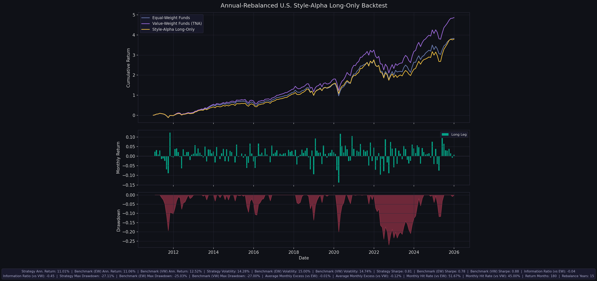

# U.S. Style-Alpha Fund-Selection Strategy (2026)

[](https://www.python.org/)


A U.S. port of the China style-alpha long/short fund strategy ([`../strategy_2026`](../strategy_2026)).
It classifies actively managed U.S. equity mutual funds into style buckets from their
factor loadings, ranks them within each bucket by factor-adjusted alpha, and holds the
top-alpha funds.

> **Headline finding (read this first).**
> Once the implementation bugs from the initial port were fixed, the strategy in U.S. funds
> roughly **matches an equal-weight peer benchmark and underperforms a value-weight (investable)
> peer benchmark.** An exhaustive 31,104-combination parameter sweep found that only **1.6 %**
> of configurations beat the value-weight benchmark, and the marginal mean information ratio
> versus the value-weight benchmark is **negative for every parameter value**. The single
> best-scoring combination is almost certainly **in-sample overfitting**.
>
> This is the *expected* result, not a coding failure: U.S. active-equity fund alpha has little
> post-fee persistence (Carhart 1997; Fama–French 2010). The same framework earns a Sharpe of
> ~1.3 in China because that retail-dominated market has much stronger, more persistent fund
> alpha. **The contrast itself is the result.**

---

## Table of Contents

- [Strategy Logic](#strategy-logic)
- [No-Lookahead Execution](#no-lookahead-execution)
- [Benchmarks: Equal-Weight vs Value-Weight](#benchmarks-equal-weight-vs-value-weight)
- [Data Inputs](#data-inputs)
- [Quick Start](#quick-start)
- [Configuration](#configuration)
- [Results & Interpretation](#results--interpretation)
- [Parameter Tuning](#parameter-tuning)
- [Why It Works in China but Not the U.S.](#why-it-works-in-china-but-not-the-us)
- [Limitations](#limitations)
- [Future Directions](#future-directions)
- [Repository Structure](#repository-structure)

---

## Strategy Logic

The workflow has two layers, both driven off a monthly factor regression of each fund's
excess return on a configurable factor set.

### 1. Factor estimation and style classification

For each annual signal date, every fund's excess return is regressed on the selected factors:

```
fund_excess_return = alpha + Σ_k beta_k · factor_k + error
```

- The **intercept (`alpha`)** is the ranking signal.
- The loadings on the **size factor (`smb`)** and **value factor (`hml`)** define the style axes.

Classification uses a three-stage schedule based on how much history a fund has
(`data_point` = number of monthly observations up to the signal date):

| `data_point` | Rule |
| --- | --- |
| `< INSUFFICIENT_DATA_THRESHOLD` | `Insufficient Data` (excluded) |
| `≤ FULL_SAMPLE_FALLBACK_MAX` | classify by the signs of `smb`/`hml` loadings **if both significant** at `P_VALUE_THRESHOLD`, else `Alpha` |
| `> FULL_SAMPLE_FALLBACK_MAX` | classify by `smb`/`hml` rolling-beta **stability ratios** (mean/std over a rolling window) if both `|ratio| >` threshold, else `Alpha` |

Sign convention (`smb`>0 → small, `hml`>0 → value):
`Large Growth`, `Large Value`, `Small Growth`, `Small Value`, or `Alpha` (unclassifiable).

> Because the regression panel runs back to fund inception (data starts 1977), almost every
> post-2010 fund has `data_point ≫ FULL_SAMPLE_FALLBACK_MAX`, so in practice classification is
> driven by the **rolling-stability branch**. The `INSUFFICIENT/FALLBACK/P_VALUE` knobs barely
> move results.

### 2. Portfolio construction

For each signal date:

1. Build the eligible universe (see [Data Inputs](#data-inputs)).
2. Split funds into the active style buckets.
3. Rank funds within each bucket by estimated `alpha`.
4. **Long** the top `BACKTEST_LONG_QUANTILE` of each bucket (e.g. top 20 %).
   Optionally **short** the bottom quantile (`BACKTEST_SHORT_QUANTILE = 0` ⇒ long-only).
5. Equal-weight across active buckets, equal-weight within each bucket's long leg.
6. Rebalance **annually**; accrue returns monthly over the holding year (weights renormalize
   over surviving funds each month).

The default configuration is **long-only** (`BACKTEST_SHORT_QUANTILE = 0`), so the strategy is
fully invested and directly comparable to a long peer benchmark.

---

## No-Lookahead Execution

- The signal at a year-end date uses only data **through that month**
  (`searchsorted(..., side="right") - 1`).
- The holding period starts the **following month** and runs to the next signal date.
- Benchmarks are measured over the same realized holding months.
- The data set already includes **dead/merged funds** (only 503 of 1,926 survive to 2025), so
  there is no gross survivorship bias. The `in_paper_sample` eligibility flag is point-in-time.

---

## Benchmarks: Equal-Weight vs Value-Weight

The strategy reports against **two** peer benchmarks, both built from the same eligible universe:

| Benchmark | Definition | Why |
| --- | --- | --- |
| **Equal-Weight (EW)** | cross-sectional mean of fund returns each month | the "naive peer" null; same weighting scheme as the strategy |
| **Value-Weight (VW)** | weighted by **beginning-of-month TNA** (lagged, so a fund's own return doesn't inflate its weight) | the *investable* bar — what the average dollar earns |

The two can differ by 1–3 %/yr, and the gap is period-dependent (the small-fund tilt that
inflates EW pre-2010 reverses in the mega-cap-led 2010–2025 window, where VW > EW). **Always
read both** — beating EW while losing to VW means the apparent edge is a weighting artifact.

---

## Data Inputs

| File | Contents |
| --- | --- |
| [`data/sf_monthly_returns.csv`](data/sf_monthly_returns.csv) | CRSP-style monthly fund returns (`mret`), TNA (`mtna`), `%` in common stock (`per_com`), and pre-computed eligibility flags |
| [`data/ff5_mom_factors.csv`](data/ff5_mom_factors.csv) | Monthly factors: `mkt_rf, smb, hml, rmw, cma, mom` (+ `rf`) |

The returns file is **already pre-filtered** to active U.S. domestic equity funds
(`is_active`, `is_us_domestic_equity`, `in_alpha_history` are all `True`; index funds removed;
all object codes `ED*`). The live eligibility filters applied in code are:

```
eligible = in_paper_sample (point-in-time)  AND  per_com >= BACKTEST_MIN_STOCK_HOLDING
```

`BACKTEST_MIN_STOCK_HOLDING` is the only universe knob you actually turn; everything else is
baked into the data file. The strategy additionally requires ≥ `INSUFFICIENT_DATA_THRESHOLD`
months of history and a non-`Alpha` style. Returns and factors are both in **decimal** units
(no ×100 mismatch).

---

## Quick Start

```bash
pip install numpy pandas matplotlib scipy statsmodels openpyxl

# single backtest with the current top-of-file configuration
python strategy_2026_US.py

# one-factor-at-a-time tuning around a baseline -> CSV + Excel
python strategy_2026_US_parameter_search.py

# exhaustive cached grid (31,104 combos, ~9 min) -> ranked CSV + Excel
python strategy_2026_US_grid_search.py
```

Outputs land in `backtest_output_annual/` (single run) and `parameter_search_output/`
(searches): `monthly_backtest_us.csv`, `monthly_holdings_us.csv`,
`performance_metrics_us.json`, and `style_alpha_backtest_us.png`.

---

## Configuration

All parameters live at the top of [`strategy_2026_US.py`](strategy_2026_US.py):

| Parameter | Meaning |
| --- | --- |
| `BACKTEST_START_DATE` / `_END_DATE` | sample window |
| `BACKTEST_MIN_STOCK_HOLDING` | min `%` in common stock (universe filter) |
| `BACKTEST_LONG_QUANTILE` | fraction of each bucket bought |
| `BACKTEST_SHORT_QUANTILE` | `0` ⇒ long-only; `>0` ⇒ dollar-neutral long/short |
| `BACKTEST_INCLUDE_ALPHA_BUCKET` | trade the unclassifiable `Alpha` bucket too |
| `ROLLING_WINDOW` / `INSUFFICIENT_DATA_THRESHOLD` | rolling-beta window / min history (months) |
| `FULL_SAMPLE_FALLBACK_MAX` | history below which the fallback classifier is used |
| `ALPHA_TRAILING_WINDOW` | months used to estimate the ranking alpha; `None` = expanding full history |
| `P_VALUE_THRESHOLD` | significance gate for the fallback classifier |
| `SMB_STABILITY_THRESHOLD` / `HML_STABILITY_THRESHOLD` | rolling-stability gates for classification |
| `FACTOR_COLUMNS` | **any subset** of `mkt_rf, smb, hml, rmw, cma, mom` |
| `SIZE_FACTOR` / `VALUE_FACTOR` | which loadings define the style axes (must be in `FACTOR_COLUMNS`) |

The factor model is fully configurable: add/remove factors by editing `FACTOR_COLUMNS`. The
intercept is always the ranking alpha; `SIZE_FACTOR`/`VALUE_FACTOR` drive classification and
are validated to be present at startup.

---

## Results & Interpretation

Representative runs (long-only, value-weight benchmark in **bold** as the investable bar):

| Window | Factors | α-window | q | Strategy Ann. | EW Ann. | **VW Ann.** | IR vs EW | **IR vs VW** | Sharpe |
| --- | --- | ---: | ---: | ---: | ---: | ---: | ---: | ---: | ---: |
| 2010–2025 | FF3 | 60 | 0.10 | 11.01 % | 11.06 % | **12.52 %** | −0.04 | **−0.45** | 0.81 |
| 2015–2025 *(grid best)* | FF3+mom | 120 | 0.20 | 13.74 % | 11.58 % | **13.19 %** | +0.67 | **+0.16** | 0.92 |



> *Reference baseline (2010–2025, FF3, long-only top-decile). The strategy (gold) tracks the
> equal-weight peer benchmark (blue) and sits **below** the value-weight peer benchmark (purple) —
> the visual signature of "no investable edge." Regenerate with the canonical config via
> `strategy_2026_US.py`; the live top-of-file config may differ.*

**How to read this:**

1. **The bugs, not the market, caused the original "very bad" result.** The first port held
   one long + one short fund *per bucket* (a degenerate portfolio from `SHORT_QUANTILE = 0`
   interacting with a `max(1, …)` floor) and estimated alpha over 40+ years of expanding
   history. Fixing those turned a −31 % drawdown bleed into a curve that tracks the peer
   average.
2. **The clean signal is weak.** Cross-sectional rank-IC of the alpha signal vs next-year
   returns averages only **+0.04 to +0.10**, and goes sharply **negative in 2020–2021** (the
   growth/momentum reversal). A ~1 %/yr gross decile spread cannot survive that drawdown, fees,
   or concentration.
3. **The 2015-start "grid best" is overfitting.** It beats VW by IR +0.16 — but it is the right
   tail of a 31,104-combination search on ≤15 years. Across the whole grid only **1.6 %** beat
   VW, and **every** parameter value has a negative *marginal* mean IR vs VW. Starting in 2015
   conveniently skips the weak 2010–2014 years.
4. **Directionally robust (not just overfit) preferences**, from the marginal analysis — these
   are economically sensible and consistent across the grid: include **momentum** (Carhart-4
   has the only positive marginal IR vs EW), a **~60-month** alpha window, **stricter** style
   thresholds (≥ 1.5), and **exclude** the `Alpha` bucket. Even stacked, they tie EW and lose
   to VW.

**Bottom line:** with this factor-alpha framework, U.S. active equity funds show **no robust,
investable edge over a value-weight peer benchmark.**

---

## Parameter Tuning

Two drivers, both writing a combined table laid out like the China reference
`search_summary.csv` (one row per run: run name, all parameters, `score`, EW/VW metrics).

### `strategy_2026_US_parameter_search.py` — quick OFAT
Varies **one parameter at a time** around a baseline (`SEARCH_MODE = "ofat"`) or runs a small
Cartesian grid (`"grid"`). It reuses the main script's exact logic by setting module globals and
re-running `run_backtest_monthly()`, so results never drift. Output:
`parameter_search_output/search_summary.{csv,xlsx}`.

### `strategy_2026_US_grid_search.py` — exhaustive cached engine
The naive approach (re-run everything per combo) would take days. This engine **caches the
expensive shared pieces** and only re-does the cheap selection per combination:

```
load_inputs / return_frame      -> once
EW / VW benchmarks              -> per min-holding
regression panel                -> per factor set
alpha / rolling snapshots       -> per (factors, start, window)
style classification            -> per (above + thresholds)   [vectorized]
monthly return accounting       -> per combination            [vectorized]
```

It **self-validates against `run_backtest_monthly`** before the grid runs (asserts identical
metrics on baseline configs), so the speed-up cannot silently diverge from the main script.
The default grid is **31,104 combinations** over factor set, start date, rolling/alpha windows,
stability thresholds, min-holding, long quantile, and the alpha-bucket flag — it completes in
**~9 minutes** and writes a ranked `grid_search_summary.{csv,xlsx}`.

The `score` mirrors the China search (annual return + excess + Sharpe + sample length −
drawdown), computed against the **EW** benchmark. Re-sort by `Information Ratio (vs VW)` in
Excel to rank by the investable bar.

---

## Why It Works in China but Not the U.S.

The strategy monetizes **cross-sectional persistence of fund alpha**. That premise is
market-structure dependent:

- **China** ([`../strategy_2026`](../strategy_2026)): retail-dominated, less efficient, weaker
  fee compression → stronger and more persistent fund-level alpha. The framework earns
  Sharpe ≈ 1.3 (2020–2025).
- **U.S.**: highly competitive and efficient, fees compress net alpha, and skill persistence is
  weak after costs → the same ranking signal has near-zero predictive power, consistent with
  Carhart (1997) and Fama–French (2010).

So the negative U.S. result is not a bug; it is a clean cross-market contrast and is itself a
publishable finding.

---

## Limitations

- **In-sample optimization risk.** With 31k combinations on ≤15 years, the best run is expected
  to look good on noise. No walk-forward / out-of-sample test has been run yet (see below).
- **No transaction costs / frictions.** Adding turnover, loads, and trading costs only worsens
  the result.
- **One signal family.** Only factor-regression alpha persistence + style ranking was tested.
- **Regime dependence.** 2010–2025 is a mega-cap/passive-led regime that is structurally hard
  for active selection; conclusions may differ in other regimes (not tradeable foreknowledge).
- **Annual rebalance + slow alpha** makes the portfolio turn over little; this is a design
  choice, not a tuned optimum.

---

## Future Directions

1. **Out-of-sample / walk-forward validation (highest priority).** Select parameters on
   2010–2018, lock them, evaluate on 2019–2025. Expectation: most "winners" collapse to ≈ VW —
   this would upgrade the conclusion from *strongly suspected* to *demonstrated* overfitting.
2. **Test other fund-selection signals** with documented predictive power that this study did
   *not* cover: **expense ratio / fees** (robust negative predictor), **fund size /
   diseconomies of scale**, **fund flows**, **active share**, **R²**, and **holdings-based
   alpha** (vs return-regression alpha).
3. **Model implementation frictions**: turnover, loads/redemption fees, dealing cutoffs.
4. **Condition on regimes** rather than a single fixed parameter set (volatility, style
   leadership, breadth).
5. **Alternative benchmarks**: compare against a passive index (e.g. market or a Morningstar
   category index), not only peer averages.

---

## References

- **Carhart, M. M. (1997).** "On Persistence in Mutual Fund Performance." *Journal of Finance*,
  52(1), 57–82. — winners do not persist after costs; momentum explains most apparent skill.
  [doi:10.1111/j.1540-6261.1997.tb03808.x](https://doi.org/10.1111/j.1540-6261.1997.tb03808.x)
- **Fama, E. F., & French, K. R. (2010).** "Luck versus Skill in the Cross-Section of Mutual
  Fund Returns." *Journal of Finance*, 65(5), 1915–1947. — few U.S. active funds have positive
  net-of-fee alpha beyond luck.
  [doi:10.1111/j.1540-6261.2010.01598.x](https://doi.org/10.1111/j.1540-6261.2010.01598.x)
- **Berk, J. B., & Green, R. C. (2004).** "Mutual Fund Flows and Performance in Rational
  Markets." *Journal of Political Economy*, 112(6), 1269–1295. — why skill need not show up as
  persistent net alpha in equilibrium.
  [doi:10.1086/424739](https://doi.org/10.1086/424739)
- **Fama, E. F., & French, K. R. (1993).** "Common Risk Factors in the Returns on Stocks and
  Bonds." *Journal of Financial Economics*, 33(1), 3–56. — the `mkt_rf, smb, hml` factors.
  [doi:10.1016/0304-405X(93)90023-5](https://doi.org/10.1016/0304-405X(93)90023-5)
- **Fama, E. F., & French, K. R. (2015).** "A Five-Factor Asset Pricing Model." *Journal of
  Financial Economics*, 116(1), 1–22. — adds the `rmw, cma` factors.
  [doi:10.1016/j.jfineco.2014.10.010](https://doi.org/10.1016/j.jfineco.2014.10.010)
- **Jegadeesh, N., & Titman, S. (1993).** "Returns to Buying Winners and Selling Losers."
  *Journal of Finance*, 48(1), 65–91. — the momentum (`mom`) factor.
  [doi:10.1111/j.1540-6261.1993.tb04702.x](https://doi.org/10.1111/j.1540-6261.1993.tb04702.x)
- **Kenneth R. French — Data Library.** Source of the FF5 + momentum factor series.
  [data library](https://mba.tuck.dartmouth.edu/pages/faculty/ken.french/data_library.html)

---

## Repository Structure

```
strategy_2026_US/
├── strategy_2026_US.py                    # main strategy + backtest (single run)
├── strategy_2026_US_parameter_search.py   # quick OFAT / small-grid tuner -> CSV + Excel
├── strategy_2026_US_grid_search.py        # cached + validated exhaustive grid engine
├── pipeline_detailed_guide.md             # detailed pipeline notes
├── data/
│   ├── sf_monthly_returns.csv             # monthly fund returns + eligibility flags
│   └── ff5_mom_factors.csv                # FF5 + momentum factors
├── backtest_output_annual/                # single-run outputs (csv / json / png)
└── parameter_search_output/               # search summaries + per-run metrics
```

---

## License / Use

Research, auditing, and educational use only. Validate the data, assumptions, and execution
model before using any of this in an investment process. This repository documents a **negative
result**: the strategy is not presented as a deployable U.S. fund-selection system.
